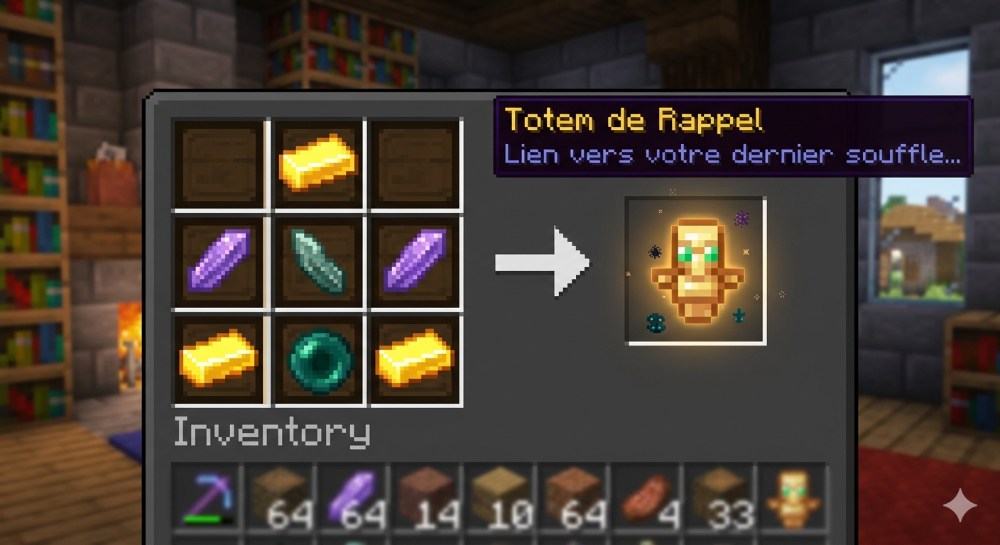

# 🌀 Totem de Rappel (Recall Totem)

Un datapack **Vanilla+** pour Minecraft **1.21.1** qui introduit une mécanique de survie essentielle : la possibilité de retourner sur le lieu de votre dernier trépas. Plus besoin de noter vos coordonnées en urgence !

---

## 📖 À quoi sert le Totem ?

Le Totem de Rappel est l'outil ultime pour les explorateurs prudents. Sa fonction est simple mais puissante : **vous téléporter instantanément à l'endroit exact de votre dernière mort**, peu importe la distance ou la dimension (`Overworld`, `Nether`, `End`).

Il permet de :
* **Sécuriser votre équipement** : Récupérez vos items avant qu'ils ne disparaissent (*despawn*).
* **Gagner du temps** : Évitez les trajets fastidieux après un accident imprévu.
* **Explorer sans crainte** : Partez à l'aventure dans les Cités Anciennes ou l'End avec une "assurance vie" en main.

---

## ⚙️ Comment ça fonctionne ?

Le fonctionnement repose sur une technologie de **mémoire dimensionnelle** optimisée pour la version 1.21 :

1.  **Enregistrement Automatique** : À chaque décès, le datapack capture vos coordonnées précises ($X, Y, Z$) et votre dimension via un score. Ces données sont stockées de manière persistante dans le `storage` du jeu.
2.  **Activation par Clic-Droit** : En tenant le totem et en effectuant un clic-droit, vous déclenchez une consommation rapide grâce au composant `consumable`.
3.  **Téléportation par Macro** : Une "Macro" de fonction s'exécute alors, ouvrant une faille spatio-temporelle qui injecte les coordonnées du storage dans la commande de téléportation. 
4.  **Consommation** : Une fois le voyage terminé, le totem se brise et disparaît.

---

## 🛠️ Le Craft (Recette)

Le Totem de Rappel se fabrique sur un établi avec des composants de résonance et de téléportation.

**Ingrédients :**
* 1 **Éclat d'Écho**
* 1 **Perle d'Ender** 
* 2 **Éclats d'Améthyste** 
* 3 **Lingots d'Or** 

**Disposition :**

> *Note : La disposition spécifique dans l'établi est requise pour infuser l'objet avec la magie de rappel.*

---

## 🚀 Installation

1.  Téléchargez le dossier du datapack.
2.  Placez-le dans le dossier de votre monde :  
    `%appdata%/.minecraft/saves/[NOM_DE_VOTRE_MONDE]/datapacks/`
3.  Lancez votre partie ou tapez la commande `/reload`.